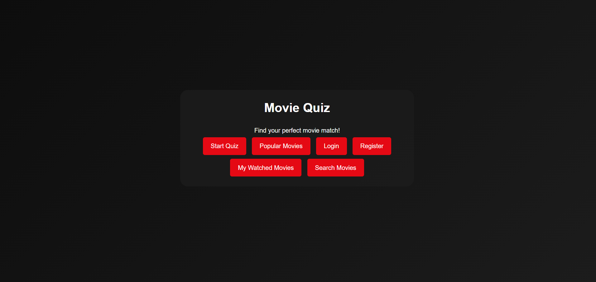
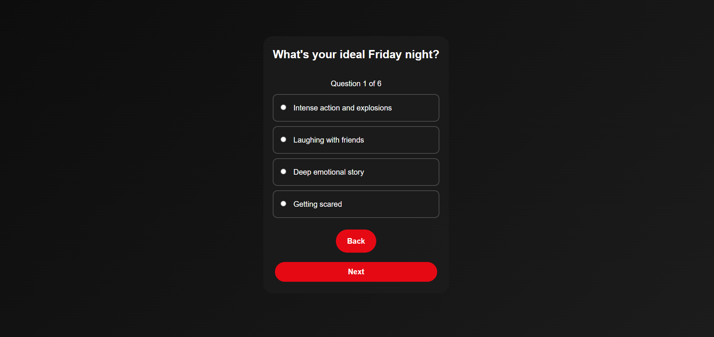
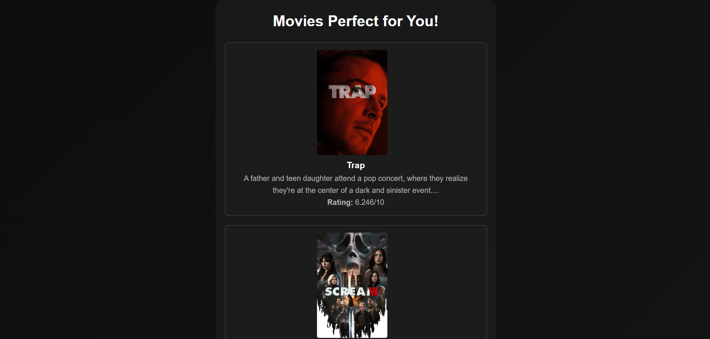
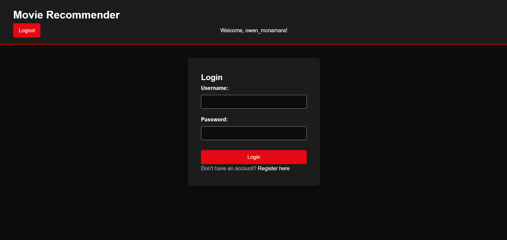
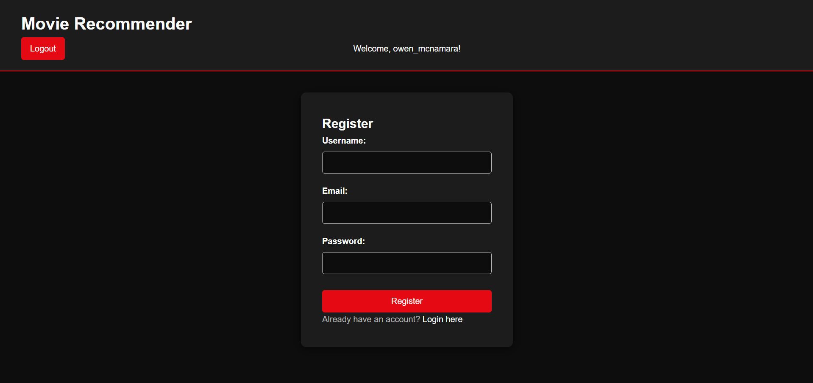
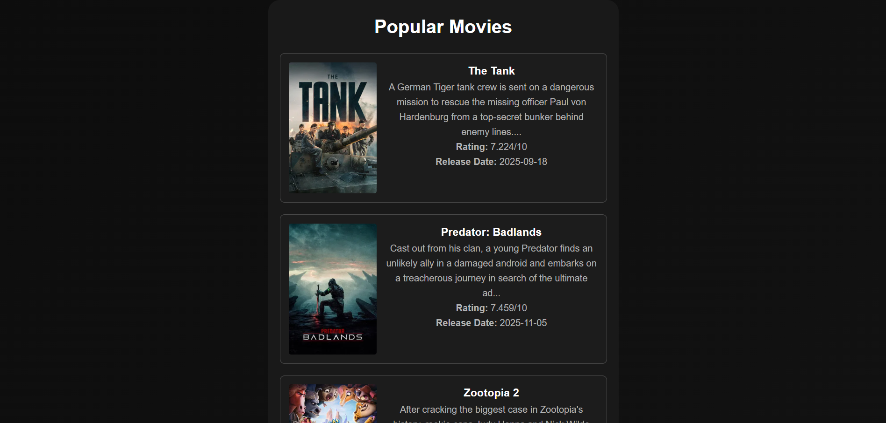
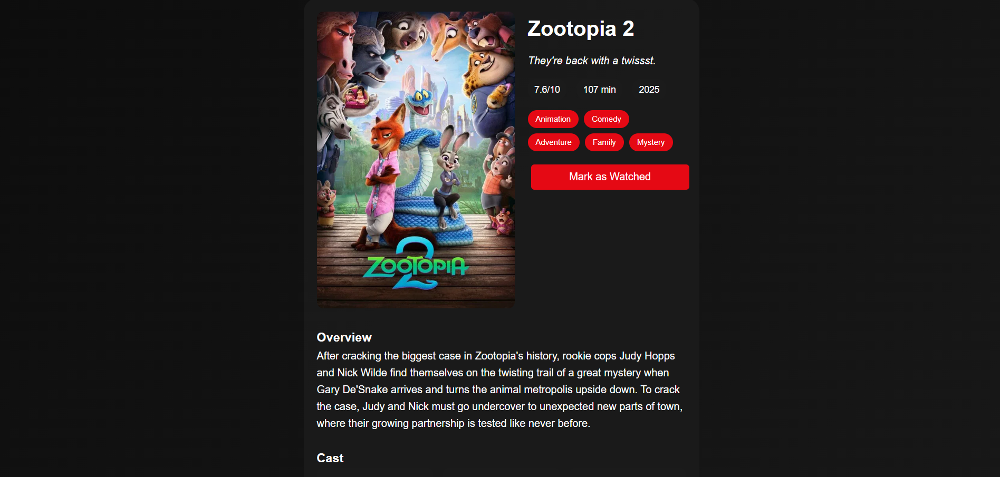

# Movie Recommender

A Flask web application that helps users discover movies through a personalized quiz system. Built with TMDB API integration and user authentication.

## Features

- **Personalized Quiz**: 6-question quiz covering genres, runtime, era, quality, setting, and mood
- **User Authentication**: Register, login, and track your movie preferences
- **Smart Recommendations**: Weighted genre scoring system based on quiz answers
- **Watched Movies Tracking**: Mark movies as watched and filter them from future recommendations
- **Movie Search**: Search for specific movies using TMDB database
- **Popular Movies**: Browse trending and popular movies
- **Movie Details**: View detailed information including cast and trailers etc

## Screenshots

 

(Images/q2.png)
(Images/q3.png)
(Images/q4.png)
(Images/q5.png)
(Images/q6.png)

## Project Structure
movie_recommender_v1/
├── app/
│ ├── static/
│ │ └── styles.css
│ ├── templates/
│ │ ├── base.html
│ │ ├── login.html
│ │ ├── register.html
│ │ ├── quiz_start.html
│ │ ├── quiz_question.html
│ │ ├── results.html
│ │ ├── movies.html
│ │ ├── movie_details.html
│ │ ├── watched.html
│ │ └── search.html
│ └── tmdb_api.py
├── main.py
├── models.py
├── requirements.txt
├── .env
└── README.md

## Setup Instructions

### Prerequisites
- Python 3.11+
- TMDB API Key (free from https://www.themoviedb.org/settings/api)
- PostgreSQL database

### Installation

1. Clone the repository:

git clone https://github.com/owen-mcnamara/movie_recommender_v1
cd movie_recommender_v1

2. Create a virtual envirnoment:
python -m venv venv
source venv/bin/activate  # On Windows: venv\Scripts\activate

3. Install dependencies:
pip install -r requirements.txt

4. Create a .env file in the root directory
SECRET_KEY=your-secret-key-here
TMDB_API_KEY=your-tmdb-api-key-here
DATABASE_URL=your-database-url-here
FLASK_ENV=development

5. Initialise the database:
python -c "from main import app, db; app.app_context().push(); db.create_all()"

6. Run the application
python main.py

The app will be available at http://localhost:5000

# How It Works
## User Registration/Login: Users create accounts to track their movie preferences

## Quiz System: 6-question quiz with weighted scoring for different genres and preferences

## Recommendation Engine: Processes quiz answers to generate personalized movie suggestions

## TMDB Integration: Fetches movie data, posters, and details from The Movie Database

## User Tracking: Stores watched movies to avoid showing them in future recommendations

# Quiz Questions

## Mood Preference: What's your ideal Friday night?

## Runtime: How much time do you have?

## Era: What time period appeals to you?

## Quality: What kind of quality are you looking for?

## Setting: What setting excites you most?

## Feeling: How do you want to feel afterward?