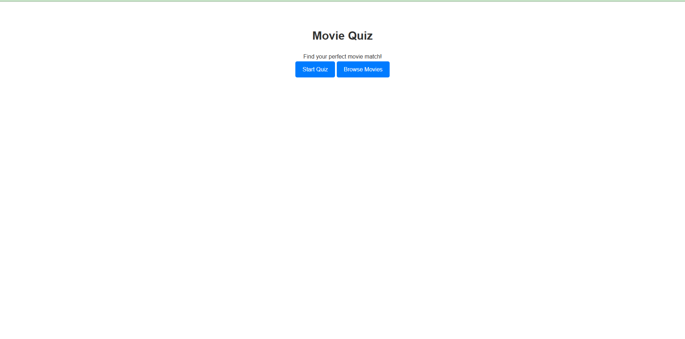
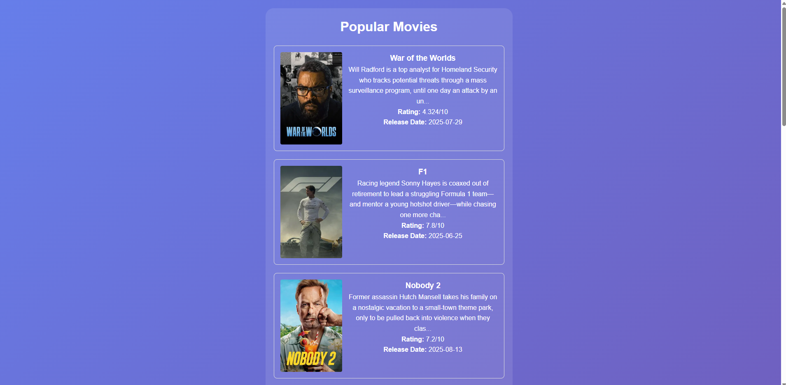
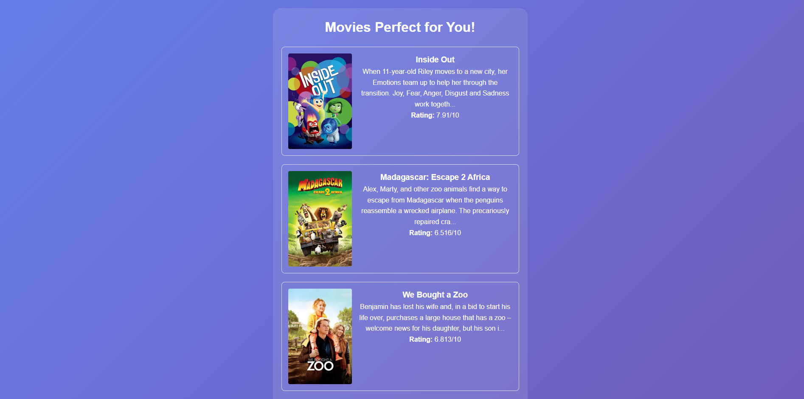

# Movie Recommender

A smart movie recommendation system built with Flask and TMDB API that uses a personalized quiz to suggest movies based on your preferences.

## Features

- **Personalized Quiz**: 6-question quiz covering genres, runtime, era, quality, setting, and mood
- **Smart Filtering**: Advanced TMDB API integration with multiple filters
- **Refresh System**: Get new recommendations without retaking the quiz
- **Session Management**: Remembers your preferences during the session

## Screenshots

 




## Setup Instructions

### Prerequisites
- Python 3.11.9
- TMDB API Key (free from https://www.themoviedb.org/settings/api)

### Installation

1. Clone the repository:
```bash
git clone https://github.com/owen-mcnamara/movie_recommender
cd movie-recommender
